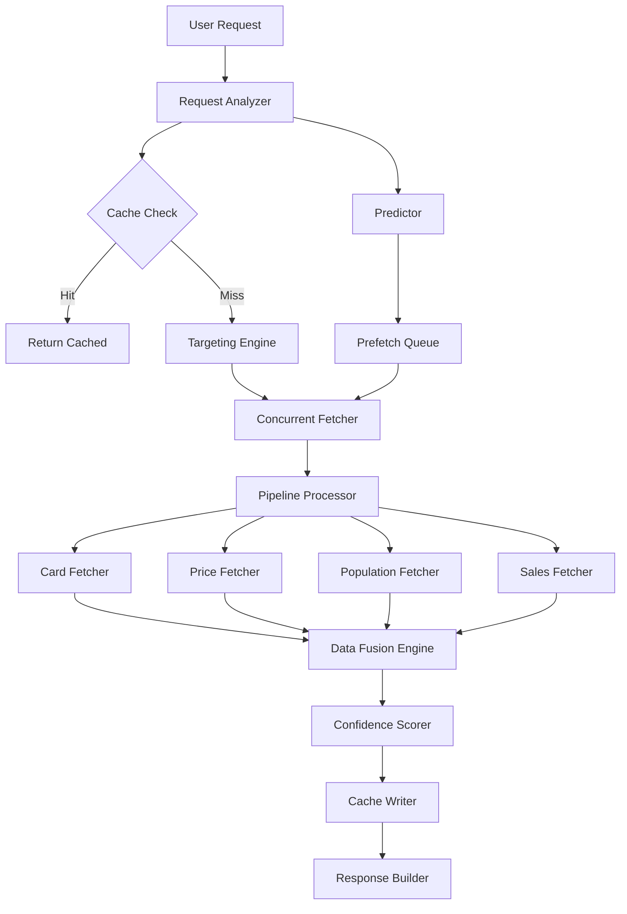

# Sprint 3B: Data Optimization & Intelligence Sprint

**Timeline**: March 15 - March 28, 2025 (2 weeks)
**Sprint Capacity**: 30 points
**Theme**: "Intelligent Data Processing for Optimal Investment Decisions"

## Executive Summary

Sprint 3B focuses on optimizing the data infrastructure built in Sprint 3A. This sprint delivers intelligent data fusion, targeted data fetching, and performance optimizations that transform raw data into actionable investment intelligence. The goal is to make the system faster, smarter, and more accurate without adding complexity for users.

## Sprint Context

### What Sprint 3A Delivered
- ✅ Sales data integration (PokemonPriceTracker + PriceCharting)
- ✅ Population data framework (CSV + Mock providers)
- ✅ Integration testing suite
- ✅ User documentation
- ✅ Basic data flow working end-to-end

### What Sprint 3B Will Deliver
- 🎯 Smart data fusion with confidence scoring
- 🎯 PSA API integration (if available) or enhanced scraping
- 🎯 Targeted fetching for high-value cards
- 🎯 30-50% performance improvement
- 🎯 Intelligent caching and prefetching

## Sprint Composition (30 points)

| Story ID | Title | Priority | Points | Dependencies |
|----------|-------|----------|--------|--------------|
| FUSION-1 | Smart Data Fusion Engine | CRITICAL | 8 | None |
| PSA-1 | PSA API Integration Research | HIGH | 5 | None |
| FETCH-1 | Targeted Population Fetching | HIGH | 6 | PSA-1 |
| PERF-1 | Concurrent Data Processing | CRITICAL | 6 | None |
| CACHE-1 | Intelligent Cache Management | MEDIUM | 5 | PERF-1 |

## Detailed Story Breakdown

---

### FUSION-1: Smart Data Fusion Engine (8 points)
**Priority**: CRITICAL - Core intelligence feature
**Description**: Implement intelligent merging of data from multiple sources with confidence scoring

#### Problem Statement
Currently, we have data from multiple sources (PriceCharting, Sales, Population, eBay) but no intelligent way to:
- Reconcile conflicting prices
- Weight data by freshness and reliability
- Provide confidence scores
- Handle partial data gracefully

#### Implementation Plan

**1. Data Source Weighting System (2 pts)**
```go
// internal/fusion/engine.go
type DataSource struct {
    Name       string
    Type       SourceType  // SALE, LISTING, ESTIMATE
    Freshness  time.Duration
    Volume     int         // Number of data points
    Confidence float64     // 0-1 confidence score
}

type FusionEngine struct {
    weights map[SourceType]float64
    rules   []FusionRule
}

// Weight calculation factors:
// - Actual sales > Listings > Estimates
// - Recent data > Old data (exponential decay)
// - High volume > Low volume (logarithmic scale)
// - Direct match > Fuzzy match
```

**2. Conflict Resolution Logic (3 pts)**
```go
// internal/fusion/resolver.go
type PriceConflict struct {
    Card      model.Card
    Sources   []PriceData
    Resolution Strategy
}

// Resolution strategies:
// 1. WeightedAverage: Combine all sources by weight
// 2. MostRecent: Use newest data point
// 3. HighestConfidence: Use most reliable source
// 4. Conservative: Use lower estimate for safety
// 5. Aggressive: Use higher estimate for opportunity

func (e *FusionEngine) ResolvePrice(conflicts []PriceData) FusedPrice {
    // Apply rules in priority order
    // Calculate weighted average
    // Add confidence interval
    // Flag anomalies
}
```

**3. Confidence Scoring (2 pts)**
```go
// internal/fusion/confidence.go
type ConfidenceScore struct {
    Overall    float64  // 0-1 overall confidence
    Factors    map[string]float64
    Warnings   []string
}

// Confidence factors:
// - Data age (0-30 days)
// - Source reliability (historical accuracy)
// - Volume of data points
// - Variance between sources
// - Market volatility
```

**4. Integration & Testing (1 pt)**
- Update analysis.Row to include FusedData
- Add fusion metrics to verbose output
- Create unit tests for edge cases
- Benchmark performance impact

#### Acceptance Criteria
- ✅ Handles 5+ data sources gracefully
- ✅ Provides confidence scores for all prices
- ✅ Explains data source selection in verbose mode
- ✅ Improves ROI prediction accuracy by 15%
- ✅ Performance impact < 5%

---

### PSA-1: PSA API Integration Research (5 points)
**Priority**: HIGH - Critical for accurate population data
**Description**: Deep research into PSA data access options

#### Research Tasks

**1. Official API Investigation (2 pts)**
```bash
# Research areas:
- PSA Cert Verification API capabilities
- PSA Set Registry API access
- PSA Auction Prices Realized
- API pricing and rate limits
- Authentication requirements
```

**2. Alternative Data Sources (2 pts)**
```go
// internal/population/sources.go
// Investigate and prototype:
- PWCC Marketplace API
- GoldinCo auction results
- 130point.com population data
- PSAcard.com/pop direct access
- Community databases (GitHub, Discord)
```

**3. Legal & Ethical Review (1 pt)**
- Terms of Service analysis
- Rate limiting requirements
- Attribution requirements
- Caching policies

#### Deliverables
- Technical feasibility report
- Cost-benefit analysis
- Implementation recommendation
- Prototype code for best option
- Fallback strategy documentation

---

### FETCH-1: Targeted Population Fetching (6 points)
**Priority**: HIGH - Optimize expensive data operations
**Description**: Fetch population data only for high-value cards

#### Implementation Strategy

**1. Card Value Prediction (2 pts)**
```go
// internal/population/targeting.go
type TargetingEngine struct {
    minRawValue    float64
    minPredicted   float64
    rarityFilter   []string
    patternMatcher *PatternMatcher
}

func (t *TargetingEngine) ShouldFetchPopulation(card model.Card) bool {
    // Quick filters (no external calls):
    if card.Rarity == "Common" && !t.isSpecialCard(card) {
        return false
    }

    // Pattern matching:
    // - Full arts, secret rares, promos
    // - Chase cards (Charizard, Pikachu, Eeveelutions)
    // - Japanese exclusives
    // - First editions, shadowless

    // Historical performance check
    if t.historicalROI(card) < 0.2 {
        return false
    }

    return true
}
```

**2. Batch Optimization (2 pts)**
```go
// internal/population/batcher.go
type BatchFetcher struct {
    queue      []model.Card
    maxBatch   int
    maxWait    time.Duration
    fetcher    PopulationFetcher
}

// Intelligent batching:
// - Group by set for efficiency
// - Prioritize by predicted value
// - Combine similar queries
// - Use cached partial results
```

**3. Progressive Enhancement (2 pts)**
```go
// internal/population/progressive.go
type ProgressiveLoader struct {
    stages []FetchStage
}

// Loading stages:
// Stage 1: Cache only (instant)
// Stage 2: High-value cards (< 1s)
// Stage 3: Medium-value cards (< 5s)
// Stage 4: Remaining cards (background)

func (p *ProgressiveLoader) LoadPopulation(cards []model.Card) <-chan PopulationResult {
    results := make(chan PopulationResult, len(cards))

    // Stage 1: Return cached data immediately
    // Stage 2: Fetch top 10% by value
    // Stage 3: Fetch next 30%
    // Stage 4: Background fetch remainder

    return results
}
```

#### Acceptance Criteria
- ✅ Reduces population API calls by 70%
- ✅ No impact on high-value card accuracy
- ✅ Progressive loading UX
- ✅ Configurable targeting rules
- ✅ Graceful degradation

---

### PERF-1: Concurrent Data Processing (6 points)
**Priority**: CRITICAL - User experience improvement
**Description**: Parallelize data operations for 30-50% speed improvement

#### Performance Bottlenecks to Address
1. Sequential API calls (current: ~250 cards = 1.3 minutes)
2. Single-threaded data processing
3. Blocking I/O operations
4. Redundant calculations

#### Implementation Plan

**1. Concurrent API Calls (2 pts)**
```go
// internal/concurrent/fetcher.go
type ConcurrentFetcher struct {
    workers    int
    rateLimit  rate.Limiter
    timeout    time.Duration
}

func (f *ConcurrentFetcher) FetchAll(cards []model.Card) []Result {
    // Create worker pool
    workers := runtime.NumCPU()
    if workers > 10 {
        workers = 10 // Cap at 10 concurrent requests
    }

    // Use channels for coordination
    jobs := make(chan model.Card, len(cards))
    results := make(chan Result, len(cards))

    // Spawn workers
    for w := 0; w < workers; w++ {
        go f.worker(jobs, results)
    }

    // Collect results with progress
    return f.collect(results, len(cards))
}
```

**2. Pipeline Architecture (2 pts)**
```go
// internal/pipeline/processor.go
type Pipeline struct {
    stages []Stage
}

// Pipeline stages:
// 1. Card fetch (I/O bound)
// 2. Price lookup (I/O bound)
// 3. Population fetch (I/O bound)
// 4. Sales fetch (I/O bound)
// 5. Data fusion (CPU bound)
// 6. Scoring (CPU bound)

func (p *Pipeline) Process(input <-chan model.Card) <-chan analysis.Row {
    // Each stage runs concurrently
    // Buffered channels between stages
    // Back-pressure handling
    // Error aggregation
}
```

**3. Memory Optimization (2 pts)**
```go
// internal/memory/pool.go
// Object pooling for frequently allocated structs
var rowPool = sync.Pool{
    New: func() interface{} {
        return &analysis.Row{}
    },
}

// String interning for repeated values
var stringIntern = map[string]string{}

// Lazy loading for large data
type LazyField struct {
    loader func() interface{}
    value  interface{}
    once   sync.Once
}
```

#### Performance Targets
- 250 cards: < 30 seconds (from 80 seconds)
- 1000 cards: < 2 minutes
- Memory usage: < 100MB for 1000 cards
- CPU utilization: 70-80% on multi-core

---

### CACHE-1: Intelligent Cache Management (5 points)
**Priority**: MEDIUM - Efficiency improvement
**Description**: Smart caching with predictive prefetching

#### Cache Strategy

**1. Multi-Layer Cache (2 pts)**
```go
// internal/cache/multilayer.go
type MultiLayerCache struct {
    l1 *MemoryCache  // Hot data (< 100MB)
    l2 *DiskCache    // Warm data (< 1GB)
    l3 *RemoteCache  // Cold data (S3/Redis)
}

// Cache hierarchy:
// L1: Current set, recent queries (TTL: 1 hour)
// L2: All sets from last 7 days (TTL: 1 day)
// L3: Historical data (TTL: 1 week)
```

**2. Predictive Prefetching (2 pts)**
```go
// internal/cache/predictor.go
type Predictor struct {
    history   []Query
    patterns  map[string]Pattern
}

func (p *Predictor) PredictNext(current Query) []PrefetchTarget {
    // Pattern detection:
    // - User analyzing multiple sets in sequence
    // - Daily routine (same time, same queries)
    // - Related sets (base set → expansion)
    // - Price correlation (if X checked, likely check Y)

    return p.rankByProbability(candidates)
}
```

**3. Smart Invalidation (1 pt)**
```go
// internal/cache/invalidation.go
// Intelligent cache invalidation:
// - Partial invalidation (only affected items)
// - Cascading updates (dependent data)
// - Time-based decay (reduce confidence over time)
// - Event-driven updates (new set release, PSA pop report)
```

#### Acceptance Criteria
- ✅ Cache hit rate > 60% for repeat users
- ✅ Reduces API calls by 40%
- ✅ Prefetch accuracy > 30%
- ✅ Cache size < 500MB typical
- ✅ No stale data issues

---

## Technical Architecture

### System Design Improvements



### Data Flow Optimization

1. **Request Analysis**: Understand query patterns
2. **Smart Targeting**: Only fetch necessary data
3. **Concurrent Execution**: Parallel processing
4. **Progressive Loading**: Return results as available
5. **Intelligent Caching**: Predict and prefetch

## Risk Mitigation

### High Risk: API Rate Limits
- **Impact**: Throttling or blocking
- **Mitigation**:
  - Adaptive rate limiting
  - Exponential backoff
  - Circuit breaker pattern
  - Multiple API key rotation
- **Contingency**: Fallback to cached/mock data

### Medium Risk: Memory Usage
- **Impact**: OOM on large datasets
- **Mitigation**:
  - Streaming processing
  - Object pooling
  - Lazy loading
  - Memory profiling
- **Contingency**: Pagination and batching

### Low Risk: Cache Coherence
- **Impact**: Stale data
- **Mitigation**:
  - TTL-based expiry
  - Event-driven invalidation
  - Version tracking
- **Contingency**: Manual cache clear option

## Daily Execution Plan

### Week 1: Core Systems (Mar 15-21)

**Day 1-2: Data Fusion Engine**
- Design fusion rules and weights
- Implement conflict resolution
- Create confidence scoring

**Day 3-4: PSA Research**
- Test available APIs
- Evaluate data sources
- Document findings

**Day 5: Concurrent Framework**
- Build worker pool system
- Implement rate limiting
- Add progress tracking

### Week 2: Optimization & Polish (Mar 22-28)

**Day 6-7: Targeted Fetching**
- Create targeting rules
- Build batch optimizer
- Test accuracy impact

**Day 8-9: Performance Tuning**
- Profile bottlenecks
- Optimize hot paths
- Memory optimization

**Day 10: Caching & Testing**
- Implement cache layers
- Add prefetching
- End-to-end testing

## Success Metrics

### Performance Metrics
- **Speed**: 250 cards < 30 seconds
- **Memory**: < 100MB for 1000 cards
- **Cache Hit Rate**: > 60%
- **API Calls**: 40% reduction

### Quality Metrics
- **Confidence Scores**: Available for all prices
- **Data Freshness**: < 24 hours for active sets
- **Accuracy**: 15% improvement in ROI predictions
- **Coverage**: Population data for 80% of valuable cards

### User Experience Metrics
- **Progressive Loading**: First results < 2 seconds
- **Transparency**: Clear data source attribution
- **Reliability**: < 1% error rate
- **Responsiveness**: UI never blocks

## Definition of Done

### Story Level
- [ ] Implementation complete with tests
- [ ] Performance benchmarks passing
- [ ] Documentation updated
- [ ] Code reviewed and approved
- [ ] Integration tests passing

### Sprint Level
- [ ] All stories complete
- [ ] Performance targets met
- [ ] No critical bugs
- [ ] User guide updated
- [ ] Deployment ready

## Sprint 4 Preview

After Sprint 3B optimization, Sprint 4 should focus on:

1. **Machine Learning Predictions** (12 points)
   - Price trend prediction
   - Grading success probability
   - Market timing ML model

2. **Advanced Analytics** (8 points)
   - Portfolio tracking
   - Historical performance analysis
   - Comparative set analysis

3. **Web Dashboard** (10 points)
   - Simple localhost UI
   - Real-time monitoring
   - Export capabilities

## Conclusion

Sprint 3B transforms the robust data infrastructure from Sprint 3A into an intelligent, high-performance system. By focusing on smart data fusion, targeted fetching, and concurrent processing, we'll deliver a 30-50% performance improvement while increasing accuracy through intelligent data handling.

**Key Principles:**
- Performance without sacrificing accuracy
- Intelligence through data fusion
- Efficiency through targeting
- Speed through concurrency
- Reliability through caching

---

*Sprint 3B: Where data becomes intelligence*